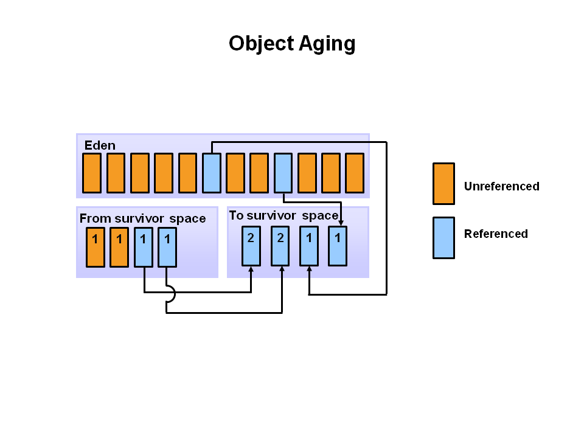

# Java Overview
 Java is a programming language and computing platform first released by Sun Microsystems in 1995. It is the underlying technology that powers Java programs including utilities, games, and business applications. Java runs on more than 850 million personal computers worldwide, and on billions of devices worldwide, including mobile and TV devices. Java is composed of a number of key components that, as a whole, create the Java platform.

## Java Runtime Edition
When you download Java, you get the Java Runtime Environment (JRE). The JRE consists of the Java Virtual Machine (JVM), Java platform core classes, and supporting Java platform libraries. All three are required to run Java applications on your computer. With Java 7, Java applications run as desktop applications from the operating system, as a desktop application but installed from the Web using Java Web Start, or as a Web Embedded application in a browser (using JavaFX).

## Java Programming Language
Java is an object-oriented programming language that includes the following features.

**Platform Independence** - Java applications are compiled into bytecode which is stored in class files and loaded in a JVM. Since applications run in a JVM, they can be run on many different operating systems and devices.
**Object-Oriented** - Java is an object-oriented language that take many of the features of C and C++ and improves upon them.
**Automatic Garbage Collection** - Java automatically allocates and deallocates memory so programs are not burdened with that task.
**Rich Standard Library** - Java includes a vast number of premade objects that can be used to perform such tasks as input/output, networking, and date manipulation.
Java Development Kit
**The Java Development Kit (JDK)** is a collection of tools for developing Java applications. With the JDK, you can compile programs written in the Java Programming language and run them in a JVM. In addition, the JDK provides tools for packaging and distributing your applications.

The JDK and the JRE share the Java Application Programming Interfaces (Java API). The Java API is a collection of prepackaged libraries developers use to create Java applications. The Java API makes development easier by providing the tools to complete many common programming tasks including string manipulation, date/time processing, networking, and implementing data structures (e.g., lists, maps, stacks, and queues).

## Java Virtual Machine
The Java Virtual Machine (JVM) is an abstract computing machine. The JVM is a program that looks like a machine to the programs written to execute in it. This way, Java programs are written to the same set of interfaces and libraries. Each JVM implementation for a specific operating system, translates the Java programming instructions into instructions and commands that run on the local operating system. This way, Java programs achieve platform independence.

The first prototype implementation of the Java virtual machine, done at Sun Microsystems, Inc., emulated the Java virtual machine instruction set in software hosted by a handheld device that resembled a contemporary Personal Digital Assistant (PDA). Oracle's current implementations emulate the Java virtual machine on mobile, desktop and server devices, but the Java virtual machine does not assume any particular implementation technology, host hardware, or host operating system. It is not inherently interpreted, but can just as well be implemented by compiling its instruction set to that of a silicon CPU. It may also be implemented in microcode or directly in silicon.

The Java virtual machine knows nothing of the Java programming language, only of a particular binary format, the class file format. A class file contains Java virtual machine instructions (or bytecodes) and a symbol table, as well as other ancillary information.

For the sake of security, the Java virtual machine imposes strong syntactic and structural constraints on the code in a class file. However, any language with functionality that can be expressed in terms of a valid class file can be hosted by the Java virtual machine. Attracted by a generally available, machine-independent platform, implementors of other languages can turn to the Java virtual machine as a delivery vehicle for their languages. (1) The Java Virtual Machine

 
## Exploring the JVM Architecture
### Hotspot Architecture
The HotSpot JVM possesses an architecture that supports a strong foundation of features and capabilities and supports the ability to realize high performance and massive scalability. For example, the HotSpot JVM JIT compilers generate dynamic optimizations. In other words, they make optimization decisions while the Java application is running and generate high-performing native machine instructions targeted for the underlying system architecture. In addition, through the maturing evolution and continuous engineering of its runtime environment and multithreaded garbage collector, the HotSpot JVM yields high scalability on even the largest available computer systems.

The main components of the JVM include the classloader, the runtime data areas, and the execution engine.

Key Hotspot Components
The key components of the JVM that relate to performance are highlighted in the following image.

There are three components of the JVM that are focused on when tuning performance. The heap is where your object data is stored. This area is then managed by the garbage collector selected at startup. Most tuning options relate to sizing the heap and choosing the most appropriate garbage collector for your situation. The JIT compiler also has a big impact on performance but rarely requires tuning with the newer versions of the JVM.

 
**Performance Basics** : 
Typically, when tuning a Java application, the focus is on one of two main goals: responsiveness or throughput. We will refer back to these concepts as the tutorial progresses.

**Responsiveness** : 
Responsiveness refers to how quickly an application or system responds with a requested piece of data. Examples include:

How quickly a desktop UI responds to an event
How fast a website returns a page
How fast a database query is returned
For applications that focus on responsiveness, large pause times are not acceptable. The focus is on responding in short periods of time.

**Throughput** : 
Throughput focuses on maximizing the amount of work by an application in a specific period of time. Examples of how throughput might be measured include:

The number of transactions completed in a given time.
The number of jobs that a batch program can complete in an hour.
The number of database queries that can be completed in an hour.
High pause times are acceptable for applications that focus on throughput. Since high throughput applications focus on benchmarks over longer periods of time, quick response time is not a consideration.

 
### Describing Garbage Collection
What is Automatic Garbage Collection?
Automatic garbage collection is the process of looking at heap memory, identifying which objects are in use and which are not, and deleting the unused objects. An in use object, or a referenced object, means that some part of your program still maintains a pointer to that object. An unused object, or unreferenced object, is no longer referenced by any part of your program. So the memory used by an unreferenced object can be reclaimed.

In a programming language like C, allocating and deallocating memory is a manual process. In Java, process of deallocating memory is handled automatically by the garbage collector. The basic process can be described as follows.

#### Step 1: Marking
The first step in the process is called marking. This is where the garbage collector identifies which pieces of memory are in use and which are not.

Referenced objects are shown in blue. Unreferenced objects are shown in gold. All objects are scanned in the marking phase to make this determination. This can be a very time consuming process if all objects in a system must be scanned.

#### Step 2: Normal Deletion
Normal deletion removes unreferenced objects leaving referenced objects and pointers to free space.

The memory allocator holds references to blocks of free space where new object can be allocated.

**Step 2a: Deletion with Compacting**

To further improve performance, in addition to deleting unreferenced objects, you can also compact the remaining referenced objects. By moving referenced object together, this makes new memory allocation much easier and faster.

Why Generational Garbage Collection?
As stated earlier, having to mark and compact all the objects in a JVM is inefficient. As more and more objects are allocated, the list of objects grows and grows leading to longer and longer garbage collection time. However, empirical analysis of applications has shown that most objects are short lived.

Here is an example of such data. The Y axis shows the number of bytes allocated and the X access shows the number of bytes allocated over time.

As you can see, fewer and fewer objects remain allocated over time. In fact most objects have a very short life as shown by the higher values on the left side of the graph.

JVM Generations
The information learned from the object allocation behavior can be used to enhance the performance of the JVM. Therefore, the heap is broken up into smaller parts or generations. The heap parts are: Young Generation, Old or Tenured Generation, and Permanent Generation

**The Young Generation** is where all new objects are allocated and aged. When the young generation fills up, this causes a minor garbage collection. Minor collections can be optimized assuming a high object mortality rate. A young generation full of dead objects is collected very quickly. Some surviving objects are aged and eventually move to the old generation.

Stop the World Event - All minor garbage collections are "Stop the World" events. This means that all application threads are stopped until the operation completes. Minor garbage collections are always Stop the World events.

**The Old Generation** is used to store long surviving objects. Typically, a threshold is set for young generation object and when that age is met, the object gets moved to the old generation. Eventually the old generation needs to be collected. This event is called a major garbage collection.

Major garbage collection are also Stop the World events. Often a major collection is much slower because it involves all live objects. So for Responsive applications, major garbage collections should be minimized. Also note, that the length of the Stop the World event for a major garbage collection is affected by the kind of garbage collector that is used for the old generation space.

**The Permanent generation** contains metadata required by the JVM to describe the classes and methods used in the application. The permanent generation is populated by the JVM at runtime based on classes in use by the application. In addition, Java SE library classes and methods may be stored here.

Classes may get collected (unloaded) if the JVM finds they are no longer needed and space may be needed for other classes. The permanent generation is included in a full garbage collection.

(2) Tuning GC with JVM 5 - Section 3 Generations

 
### The Generational Garbage Collection Process
Now that you understand why the heap is separted into different generations, it is time to look at how exactly these spaces interact. The pictures that follow walks through the object allocation and aging process in the JVM.

First, any new objects are allocated to the eden space. Both survivor spaces start out empty.

When the eden space fills up, a minor garbage collection is triggered.

Referenced objects are moved to the first survivor space. Unreferenced objects are deleted when the eden space is cleared.

At the next minor GC, the same thing happens for the eden space. Unreferenced objects are deleted and referenced objects are moved to a survivor space. However, in this case, they are moved to the second survivor space (S1). In addition, objects from the last minor GC on the first survivor space (S0) have their age incremented and get moved to S1. Once all surviving objects have been moved to S1, both S0 and eden are cleared. Notice we now have differently aged object in the survivor space.

At the next minor GC, the same process repeats. However this time the survivor spaces switch. Referenced objects are moved to S0. Surviving objects are aged. Eden and S1 are cleared.

This slide demonstrates promotion. After a minor GC, when aged objects reach a certain age threshold (8 in this example) they are promoted from young generation to old generation.

As minor GCs continue to occure objects will continue to be promoted to the old generation space.

So that pretty much covers the entire process with the young generation. Eventually, a major GC will be performed on the old generation which cleans up and compacts that space.

