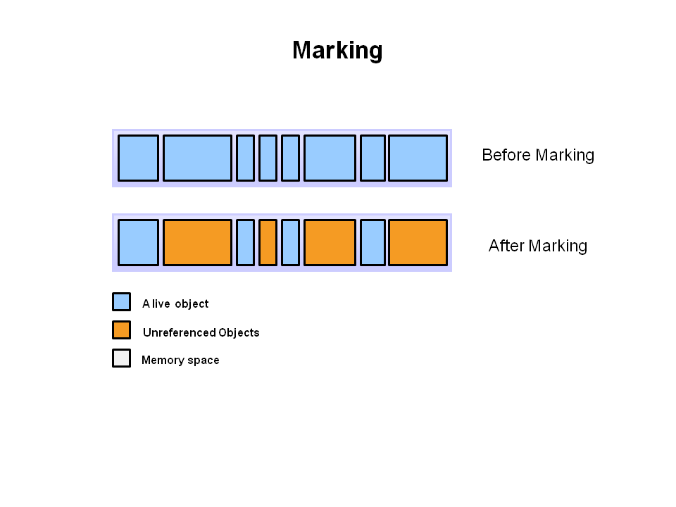
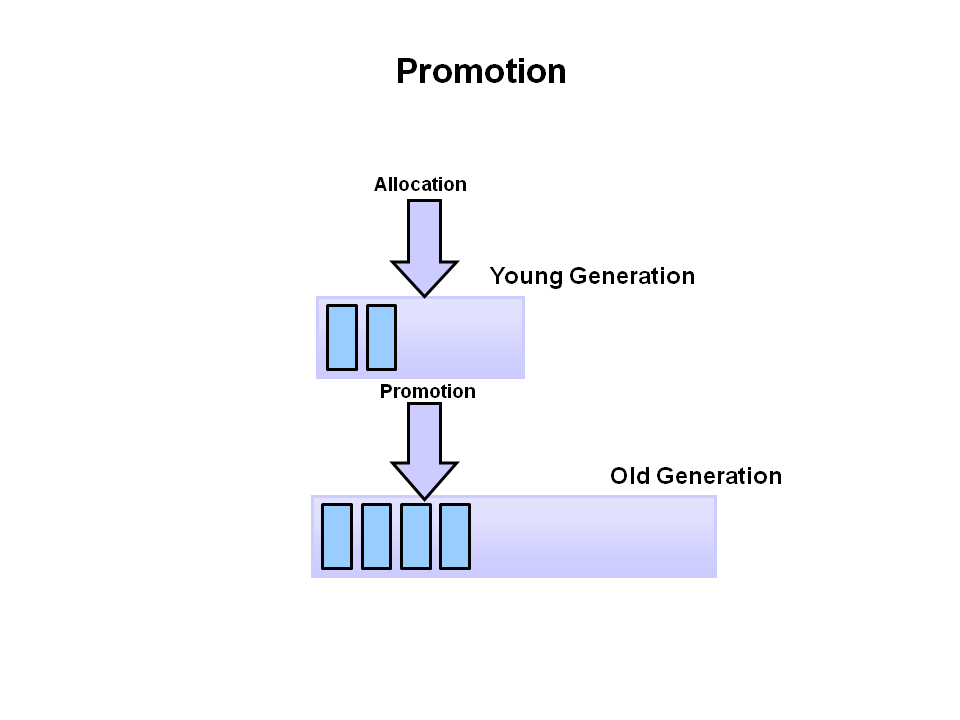

L1-00:40 What do you mean by Virtual Machine?

    A software program that simulates behaviour of a physical machine, which can perform operations
    like any other physical machine. For example,
    -> VMWare is the system based virtual machine
    -> JVM is the Application based virtual machine

L1-01:17 What is JVM?

    "Java Virtual Machine"
    Basically JVM provides runtime environment in which Java programs are executed.
    First the java programs get compiled and converted into byte code.
    JVM is responsible for loading Class files and executing that byte code.

-> What makes Java platform independent? Or what you mean by 'write once, run anywhere'?⭐️

    JVM converts the byte code to the machine specific code i.e,
    one java program can be executed on any type operating system because of JVM.
    That is why we need different kinds of JVM for different Operating systems.

L1-02:36 Is JVM, a compiler or interpreter ?⭐️

    JVM is an interpreter.

L1-02:45 What are JRE, JDK? how these are different from JVM?⭐️
    
    JRE: JRE stands for Java runtime environment and JVM is actually an implementation of JRE.
    It consists of set of libraries like jar files and other files that JVM uses at runtime.
    so it is different from JVM as it only contains the environment to execute java program.

    JDK: The Java development kit consists more than JRE, as it provides all the tools which
    are used to develop java applications along with tools and executable required to compile,
    debug and execute java program.

L1-04:25 How JVM works?⭐️
   
    We know, JVM is a runtime engine to run the java applications.. when we write a java file..
    the compiler creates the Class file having the byte code.. This .class file goes into various steps.

L2-00:17 What is Classloader?⭐️
    
    Class loader is a set of components which loads the classes during runtime into JVM.
    These classes are not loaded all at once, when the application requires that particular class or we can say
    when we try to use a Class, Java ClassLoader loads that class into memory.

L2-00:43 What activities are performed by the classloader subsystem?
    
    Class loader subsystem is responsible to perform these three activities:
	     1.Loading
	     2.Linking
	     3.Initialization

       Loading: The classloader reads the class and generates the binary data.
       This binary data get stored inside method area.
                Method area - class related data gets stored.
       With all the class info, JVM creates an object of Type : java.lang.Class for that loaded class in
       heap area.
       This 'java.lang.Class' class object provides complete information for that class.

02:30  -> If we call a class more than once, will there be more than one java.lang.Class object for that class?

            NO. Even though we call the class multiple times but in the heap area there will be only one
            Class class object, because one Class class object for that particular class is enough to
            provide information for that class. For any new object the class information will remain same.

        Linking: It consists of three activities..
                Verify
                Prepare
                Resolve

            Verification: Bytecode verifier ensures that code passed to java interpreter is in a fit state
            to be executed.
            This is also a reason why JAVA is secure..

            Preparation: JVM allocates memory to class level variables and assign default values to them.

            Resolution: JVM replaces symbolic names with original memory references from method area.
                        class Demo{
                          public static void public static void main(String[] args) {
                            String s = ...
                            Student s1 = new Student();
                          }
                        }

                    Constant Pool of Demo : Demo, String, Student
              In resolution, these names will get replaced with memory level references from method area.

        Initialization: -> Original value get assigned to the static variables.
                        -> Static blocks get executed from parent to child and top to bottom in this phase.

        Note: While loading linking initialisation any error occurs,
        then we will get runtime exception saying java.lang.linkage error.

L2-07:14 What are the different class loaders used by JVM?

    There are three diff class loaders, each of them has a predefined location from where they loads class.

    Bootstrap Class Loader | Primordial Class loader:

        It is responsible to load the classes which are present in bootstrap path (jdk->jre->lib->rt.jar)
        like, rt.jar..
        rt.jar -> core java apis.
        so this Class loader loads the core java api classes.

        This Class loader is parent of all other class loaders in java. It is not implemented in java.

    Extension Class Loader:

        This Class loader is responsible to load classes from the extension path. (jre/lib/ext/'*'.jar)
        Extension Class loader is the implementation of Bootstrap Class loader.
        It is implemented by sun.misc.Launcher$ExtClassLoader

    Application Class loader | System Class loader:

        It is responsible for loading the classes from the CLASSPATH environment variable.
        This is the child class of Extension Class loader.
        It is implemented by sun.misc.Launcher$AppClassLoader.

    Note: Except the bootstrap classloader which is only implemented in native languages not in java,
    all the classloader are implemented using java.lang.ClassLoader.

L2-09:28 How does JVM load the classes?⭐️

    The classloader subsystem works on the delegation principle. One classloader delegates the
    responsibility for loading the class to their parent and if it doesn't work, then they loads the class
    by themselves

 What is the difference between static and dynamic class loading?⭐️

L2-12:30 What is difference between Class.forName() and ClassLoader.loadClass()?⭐️

    Both methods try to load classes dynamically.

    The most common method is Class.forName(). By default the classes get initialised using this method.

    loadClass() is an instance method and requires a particular ClassLoader to load the class.

    By default the classes does not get initialised in this.

//Memory Areas
L3-00:12 What are the various memory areas present in JVM?⭐️

    JVM has 5 different memory areas ..
    1. Method area
    2. Stack area
    3. Heap area
    4. PC Registers
    5. Native method area

L3-00:30 Which memory area is used to store Static variables?

    JVM stores the Class level information in the Method area.
    Class level information consists Class name, parent Class name, Method info, Variables info,
    Constructors, Modifiers info, Constant pool info etc.

    Whenever we start JVM, a method area gets created,
    👉🏻 and that will be shared among all JVM threads.

L3-01:14 When are the static variables loaded in memory?

    Static variables get loaded at the time of Class loading and gets stored in the method area.

L3-01:31 What is Heap space in Java?⭐️

    Heap memory in JVM is used to store objects and corresponding instance variables.
    👉🏻 Whenever we create objects, it is always created in Heap space.

    Heap area gets created when we start JVM
    👉🏻 Heap area is shared among all the threads.

    Method and heap area need not be continuous.

L3-02:10 What is String pool?⭐️

    String pool or string intern pool is a special storage area in Heap space.
    When we create a string, it gets stored to the string pool, so that if any other string will get
    created which exists in the pool then instead of creating new object,
    the reference of existing string will be returned.

L3-03:04 What is Stack? What it stores?⭐️

    Stack is a part of memory that stores each method call performed by that thread including primitives
    and local variables.

    👉🏻 For every thread, a new runtime stack gets created..

L3-05:42 What is stack frame? What does it consist?

    Each entry in stack is called stack frame.
    1. Local Variable Array
            -> Which store local variables and corresponding values related to any method.
    2. Operand Stack
            -> It is a runtime workspace for JVM, to perform any intermediate operations.
    3. Frame data
            -> All symbols corresponding to any method are stored here.

    👉🏻 For every method call one stack frame is created.

How stack and heap are interrelated?⭐️

    We know Local variables are stored on the stack, and all the objects in java are stored on the
    Heap area.
    👉🏻 For every object on the heap, there is a pointer which is the reference to that object.
    This reference variable is also stored on the stack. This is how Stack and heap are interrelated..

How to get information about heap memory?

    We know the java application can communicate directly with JVM via runtime class.
    Runtime Class provides various methods from which we can get information about memory.

    We create Runtime instance via method getInstance(), because this Class is Singleton class.

    Runtime r = Runtime.getInstance();
    r.maxMemory();
    //this method returns the maximum amount of memory that the Java virtual machine will attempt to use.

    r.totalMemory()		//this returns the total amount of memory in the Java virtual machine.

    r.freeMemory();		//this returns the amount of free memory in the Java Virtual Machine.

What happens when there is not enough Heap Space for storing new objects?⭐️

    JVM tries to free up space but if it fails then JVM throws java.lang.OutOfMemoryError.

How to set minimum and maximum heap size??

    By using -Xmx we can specify the maximum heap size for any program..
    And -Xms to set the minimum heap size..

    $ java -Xms512m -Xmx1024m <classname>

Why do member variables have default values whereas local variables do not have any default value ?

    In java, ClassLoader is responsible to load the Class and while loading the Class they initialize
    the static variable and blocks.

    JVM does not have any idea about local variables at the time of Class loading, therefore
    local variables do not have any default values.

What PC registers are for?

    👉🏻 Every thread has separate PC register.
    PC registers is used to hold the address of current executing instruction. when the instruction gets
    executed the PC register will be updated with the next one.

What is Native Method Stack?

    It is another memory space of JVM which stores the native method information.
    👉🏻 for every thread, there will be a separated native method stack.

//Execution Engine

What is Execution engine? What it does?

    Execution engine is the component in JVM which is responsible to execute the byte code which is
    assigned to the runtime data area.

    It has following sub-components:
    1. Interpreter
    2. JIT compiler
    3. Garbage collector

What is Interpreter?

    Interpreter is a program that reads byte code in the sequential manner (line by line).
      it runs the application by accepting file name argument from the command line,

      java <compiled file name>

What are the limitations interpreter has?

    Interpreter interprets fast but executes slow!
    The limitation is, when a code of block or one method is called multiple times,
    every time a new interpretation is required.

What is JIT compiler?⭐️

    It stands for Just-in-time compiler.
    It compiles those byte code parts which are having similar functionality at the same time.

Sub components of JIT compiler:

    1. Intermediate code generator: it produces intermediate code.
    2. Code Optimizer: Responsible for optimizing that intermediate code.
    3. Target code generator: Responsible for generating native code!
    4. Profiler: Responsible for finding the hot code! It finds which method is called multiple times.

What is Garbage collector?

    It is the component of Execution engine which frees up the memory by collecting and removing
    the unreferenced objects.

//

What is garbage collection?

    Garbage is unused and unreferenced objects, and Garbage collection is the process inside JVM which
    identifies and discards those objects which are no longer required in the application.

    ->It is a mechanism of JVM to reclaim heap space from objects which are eligible for garbage collection.

Which objects are eligible for garbage collection?

    Any object on the heap which unreachable through a reference from the stack is eligible for garbage collection.

Is programmer responsible to destroy objects?⭐️

    No! In java programmer need not to worry for this. Garbage collector destroys the objects which are no longer in use.
    Before calling garbage collector, it is recommended to make the unused object available for garbage collection.

How to make an object available for garbage collection?⭐️

    There are 4 ways to do so,

    1. Nullifying the reference variable: by doing so the object in heap will be unreachable from the stack.

    2. Reassigning the reference variable: the variable gets assigned with new object and the older one gets unreferenced from stack..

    3. Object inside method: we know for every method call the stack has a stack frame, which consists of all of its members. When a method is executed the stack frame is popped out from
    stack and thus all of its members get unreferenced from the stack.

    4. Creating anonymous object: we know an anonymous object is not referenced, so it is eligible for garbage collection.

How to call garbage collector?

    The most common way to invoke garbage collector is by invoking gc method of system class.
          System.gc();

    Other way is to invoke gc method with Runtime class.
          Runtime.getRuntime().gc();

    This method suggests the JVM to recycle the unused objects in order to make the memory available for
    future allocation.

Can you guarantee that invoking gc will definitely call garbage collector?⭐️

    By invoking gc, we just request or suggest JVM to call garbage collector. But there is no guarantee
    that the Java virtual machine will do that. So answer is no!

If an object reference is set to null, will the Garbage Collector immediately free the memory held by that object ?

    No, the object will be available for garbage collection in the next cycle of the garbage collector.

When should we call garbage collector to run?

    When we are executing multiple blocks of code and after executing one block
    -> if we want to free the memory so that the next block of code may execute more efficiently
    -> if you are trying to get more accurate evaluation and want to start those code block with the same
    state as we started the very first block..
    .. then we may call the gc.

Why is it bad idea to run gc?

    As we know we can not guarantee that the garbage collector will process when we call gc, so we should
    just do not bother to do it.
    Because when we call gc, Garbage collection temporarily stops all threads in our application for running.
    When garbage collection takes place our application is temporarily suspended.. and it would not resume
    until the gc process complete.
    This 'stops the world!' That is, running garbage collection can cause an unacceptable freeze in
    execution.

When is the finalize() method gets called? What is the purpose of calling it?

    Finalise method is a special method present in object class. That means every class can override this
    method.
    when we call the gc, it calls the finalise method before performing the clean up activity. This allows
    programmer to perform other clean up activities too
    -> like releasing any system resource, closing connections..

    So when it is called? It is called before performing garbage collection.

    However we can not be assured that the finalise method will be called when we call the gc..
    We don't have any idea that the method is going to be called or not or when this method will going to
    be called.

Why we should not use finalize() method?⭐️

    There is no assurance that finalize method will get called. Therefore it gets useless sometimes to put
    any clean up code in the finalise method.

So there is no use of finalize method?

    We can use this method to check that are the rosaries are closed or not?
    So you may not use finalize method to correct the problem but at least send out a warning that
    something could be wrong.

What are memory leaks? What are soft references?

    memory leak is a scenario that occurs when objects are no longer being used by the application,
    but the Garbage Collector is unable to remove them from working memory – because they’re still being referenced.
     As a result, the application consumes more and more resources – which eventually leads to OutOfMemoryError.

    Soft leaks: it may be possible that any objects are not being used for years but any third party API or
    any other thing is there for keeping it live.. these kind of objects should be garbaged but they are
    not because they are somehow referenced from stack.⭐️

    # Java Overview
 Java is a programming language and computing platform first released by Sun Microsystems in 1995. It is the underlying technology that powers Java programs including utilities, games, and business applications. Java runs on more than 850 million personal computers worldwide, and on billions of devices worldwide, including mobile and TV devices. Java is composed of a number of key components that, as a whole, create the Java platform.

## Java Runtime Edition
When you download Java, you get the Java Runtime Environment (JRE). The JRE consists of the Java Virtual Machine (JVM), Java platform core classes, and supporting Java platform libraries. All three are required to run Java applications on your computer. With Java 7, Java applications run as desktop applications from the operating system, as a desktop application but installed from the Web using Java Web Start, or as a Web Embedded application in a browser (using JavaFX).

## Java Programming Language
Java is an object-oriented programming language that includes the following features.

**Platform Independence** - Java applications are compiled into bytecode which is stored in class files and loaded in a JVM. Since applications run in a JVM, they can be run on many different operating systems and devices.
**Object-Oriented** - Java is an object-oriented language that take many of the features of C and C++ and improves upon them.
**Automatic Garbage Collection** - Java automatically allocates and deallocates memory so programs are not burdened with that task.
**Rich Standard Library** - Java includes a vast number of premade objects that can be used to perform such tasks as input/output, networking, and date manipulation.
Java Development Kit
**The Java Development Kit (JDK)** is a collection of tools for developing Java applications. With the JDK, you can compile programs written in the Java Programming language and run them in a JVM. In addition, the JDK provides tools for packaging and distributing your applications.

The JDK and the JRE share the Java Application Programming Interfaces (Java API). The Java API is a collection of prepackaged libraries developers use to create Java applications. The Java API makes development easier by providing the tools to complete many common programming tasks including string manipulation, date/time processing, networking, and implementing data structures (e.g., lists, maps, stacks, and queues).

## Java Virtual Machine
The Java Virtual Machine (JVM) is an abstract computing machine. The JVM is a program that looks like a machine to the programs written to execute in it. This way, Java programs are written to the same set of interfaces and libraries. Each JVM implementation for a specific operating system, translates the Java programming instructions into instructions and commands that run on the local operating system. This way, Java programs achieve platform independence.

The first prototype implementation of the Java virtual machine, done at Sun Microsystems, Inc., emulated the Java virtual machine instruction set in software hosted by a handheld device that resembled a contemporary Personal Digital Assistant (PDA). Oracle's current implementations emulate the Java virtual machine on mobile, desktop and server devices, but the Java virtual machine does not assume any particular implementation technology, host hardware, or host operating system. It is not inherently interpreted, but can just as well be implemented by compiling its instruction set to that of a silicon CPU. It may also be implemented in microcode or directly in silicon.

The Java virtual machine knows nothing of the Java programming language, only of a particular binary format, the class file format. A class file contains Java virtual machine instructions (or bytecodes) and a symbol table, as well as other ancillary information.

For the sake of security, the Java virtual machine imposes strong syntactic and structural constraints on the code in a class file. However, any language with functionality that can be expressed in terms of a valid class file can be hosted by the Java virtual machine. Attracted by a generally available, machine-independent platform, implementors of other languages can turn to the Java virtual machine as a delivery vehicle for their languages. (1) The Java Virtual Machine

 
## Exploring the JVM Architecture
### Hotspot Architecture
The HotSpot JVM possesses an architecture that supports a strong foundation of features and capabilities and supports the ability to realize high performance and massive scalability. For example, the HotSpot JVM JIT compilers generate dynamic optimizations. In other words, they make optimization decisions while the Java application is running and generate high-performing native machine instructions targeted for the underlying system architecture. In addition, through the maturing evolution and continuous engineering of its runtime environment and multithreaded garbage collector, the HotSpot JVM yields high scalability on even the largest available computer systems.

The main components of the JVM include the classloader, the runtime data areas, and the execution engine.

Key Hotspot Components
The key components of the JVM that relate to performance are highlighted in the following image.

There are three components of the JVM that are focused on when tuning performance. The heap is where your object data is stored. This area is then managed by the garbage collector selected at startup. Most tuning options relate to sizing the heap and choosing the most appropriate garbage collector for your situation. The JIT compiler also has a big impact on performance but rarely requires tuning with the newer versions of the JVM.

 
**Performance Basics** : 
Typically, when tuning a Java application, the focus is on one of two main goals: responsiveness or throughput. We will refer back to these concepts as the tutorial progresses.

**Responsiveness** : 
Responsiveness refers to how quickly an application or system responds with a requested piece of data. Examples include:

How quickly a desktop UI responds to an event
How fast a website returns a page
How fast a database query is returned
For applications that focus on responsiveness, large pause times are not acceptable. The focus is on responding in short periods of time.

**Throughput** : 
Throughput focuses on maximizing the amount of work by an application in a specific period of time. Examples of how throughput might be measured include:

The number of transactions completed in a given time.
The number of jobs that a batch program can complete in an hour.
The number of database queries that can be completed in an hour.
High pause times are acceptable for applications that focus on throughput. Since high throughput applications focus on benchmarks over longer periods of time, quick response time is not a consideration.

 
### Describing Garbage Collection
What is Automatic Garbage Collection?
Automatic garbage collection is the process of looking at heap memory, identifying which objects are in use and which are not, and deleting the unused objects. An in use object, or a referenced object, means that some part of your program still maintains a pointer to that object. An unused object, or unreferenced object, is no longer referenced by any part of your program. So the memory used by an unreferenced object can be reclaimed.

In a programming language like C, allocating and deallocating memory is a manual process. In Java, process of deallocating memory is handled automatically by the garbage collector. The basic process can be described as follows.

#### Step 1: Marking
The first step in the process is called marking. This is where the garbage collector identifies which pieces of memory are in use and which are not.

Referenced objects are shown in blue. Unreferenced objects are shown in gold. All objects are scanned in the marking phase to make this determination. This can be a very time consuming process if all objects in a system must be scanned.

#### Step 2: Normal Deletion
Normal deletion removes unreferenced objects leaving referenced objects and pointers to free space.

The memory allocator holds references to blocks of free space where new object can be allocated.

**Step 2a: Deletion with Compacting**

To further improve performance, in addition to deleting unreferenced objects, you can also compact the remaining referenced objects. By moving referenced object together, this makes new memory allocation much easier and faster.

Why Generational Garbage Collection?
As stated earlier, having to mark and compact all the objects in a JVM is inefficient. As more and more objects are allocated, the list of objects grows and grows leading to longer and longer garbage collection time. However, empirical analysis of applications has shown that most objects are short lived.

Here is an example of such data. The Y axis shows the number of bytes allocated and the X access shows the number of bytes allocated over time.

As you can see, fewer and fewer objects remain allocated over time. In fact most objects have a very short life as shown by the higher values on the left side of the graph.

### Garbage collection and Java
In programming languages like C, developers have to take close care of memory by allocating and deallocating it accordingly.

Java, on the other hand, has its own automatic garbage collection with the idea that most developers don’t have to worry too much about such manual memory tasks, if at all.

In a nutshell, objects in Java are allocated in a heap (also known as heap memory). Java’s garbage collection algorithm then goes through the heap and marks objects that are in use by the JVM and then later on goes back and reclaims the memory of any object that was not marked.

The details of that algorithm is for another article, but what is important is the marking itself and the fact that the heap is allocated into smaller parts, called generations.

In the above diagram, we finally see the terms “young generation”, “old generation”, and “permanent generation”. If it looks scary, don’t worry; the basic concepts are actually pretty intuitive.

#### The Young Generation
From a high level, the young generation is where all new objects start out. Once they’re allocated in the Java code, they go specifically to this subsection called the eden space.

Eventually, the eden space fills up with objects. At this point, a minor garbage collection event occurs.

That’s where the marking algorithm I described earlier comes into play. Some objects (those that are referenced) are marked, and some (those that are unreferenced) are not. Those that had been marked then move onto another subsection of the young generation called S0 of the survivor space (note that the survivor space itself is split into two parts, S0 and S1). Those left unmarked are cleared out by Java’s automatic garbage collection.

It stays this way until the eden space fills up again; at this point, a new cycle kicks off. The previous paragraph’s events happen again, but in this cycle, it’s a little different. S0 was populated, and so all marked objects that survive from both the eden space and S0 actually go to the second part of the survivor space called S1. In the below diagram, we see that they’re labeled the from survivor space and the to survivor space, respectively.

One very important thing to note that any objects that make it to the survivor space gets tagged with an age counter. The algorithm will check this to see if it meets a threshold to go to the next stage: the old generation. More on that in a later section.

OK, let’s take a deep breath here, because during the next cycle of garbage collection, it gets a little strange, but it’s not too bad. Essentially, when the eden space fills up again and triggers another minor garbage collection, we’re not putting all the marked (referenced) objects into S1; rather, the from and to survivor spaces are switched.

Hopefully the above diagram illustrates the switching of the from and to survivor space. The thing that I personally take away from here is that objects don’t necessary go from S0 to S1 of the survivor space. Really, they just alternate to where they switch to with every minor garbage collection event.

And honestly, this is pretty into the nitty-gritty. It’s probably more than enough knowledge to just know that essentially all new objects start out in the eden space and then eventually make their way into a survivor space as they survive garbage collection cycles.

#### The Old Generation
The old generation can be thought of as where long-lived objects lie. Basically, if objects reach a certain age threshold after multiple garbage collection events in the young generation, then they can then be moved to the old generation.

When objects get garbage collected from the old generation, a major garbage collection event occurs.

Let’s see what a promotion from the survivor space of the young generation to the old generation looks like.

In the above example, any surviving objects that have hit an age threshold of 8 cycles — and this is just an example, so don’t specifically memorize that number — is moved by the algorithm to the old generation.

The old generation is comprised of only one section called the tenured generation. This is why in conversation or in reading sometimes that the two terms have come to be mostly interchangeable.

The events that lead to a clearing of the old generation — again, a major garbage collection event — can vary, and it’s not particularly within the scope of this article to know them. Let’s move on.

#### The Permanent Generation
So here’s a big gotcha. The permanent generation is not populated when the old generation’s objects reach a certain threshold and then get moved (promoted) to the permanent generation. Again, it doesn’t work this way!

Rather, the permanent generation is immediately filled up by the JVM with the metadata that represents the applications’ classes and methods at runtime.

The JVM may sometimes follow certain rules to clean out the permanent generation, and when it does, it’s called a full garbage collection.

What is a “stop the world” event?
A “stop the world” event sounds pretty dramatic, but think of it in terms of the Java application being the world.

When there’s a minor garbage collection (remember: for the young generation) or a major garbage collection (for the old generation), then the world stops; in other words, all application threads are completely stopped and have to wait for the garbage collection event to complete.

 
### The Generational Garbage Collection Process
Now that you understand why the heap is separted into different generations, it is time to look at how exactly these spaces interact. The pictures that follow walks through the object allocation and aging process in the JVM.

First, any new objects are allocated to the eden space. Both survivor spaces start out empty.

When the eden space fills up, a minor garbage collection is triggered.

Referenced objects are moved to the first survivor space. Unreferenced objects are deleted when the eden space is cleared.

At the next minor GC, the same thing happens for the eden space. Unreferenced objects are deleted and referenced objects are moved to a survivor space. However, in this case, they are moved to the second survivor space (S1). In addition, objects from the last minor GC on the first survivor space (S0) have their age incremented and get moved to S1. Once all surviving objects have been moved to S1, both S0 and eden are cleared. Notice we now have differently aged object in the survivor space.

At the next minor GC, the same process repeats. However this time the survivor spaces switch. Referenced objects are moved to S0. Surviving objects are aged. Eden and S1 are cleared.

This slide demonstrates promotion. After a minor GC, when aged objects reach a certain age threshold (8 in this example) they are promoted from young generation to old generation.

As minor GCs continue to occure objects will continue to be promoted to the old generation space.

So that pretty much covers the entire process with the young generation. Eventually, a major GC will be performed on the old generation which cleans up and compacts that space.

