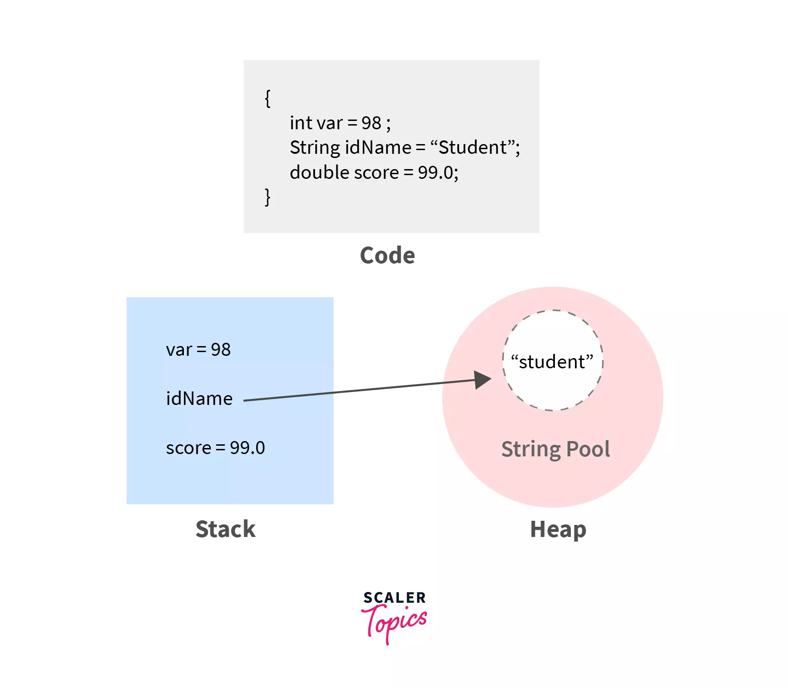
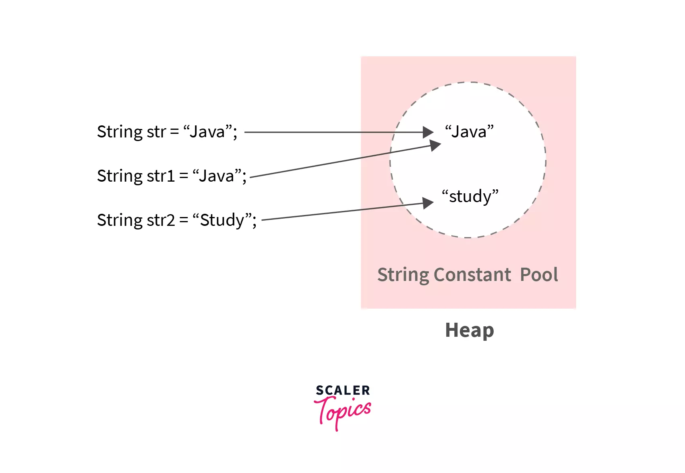
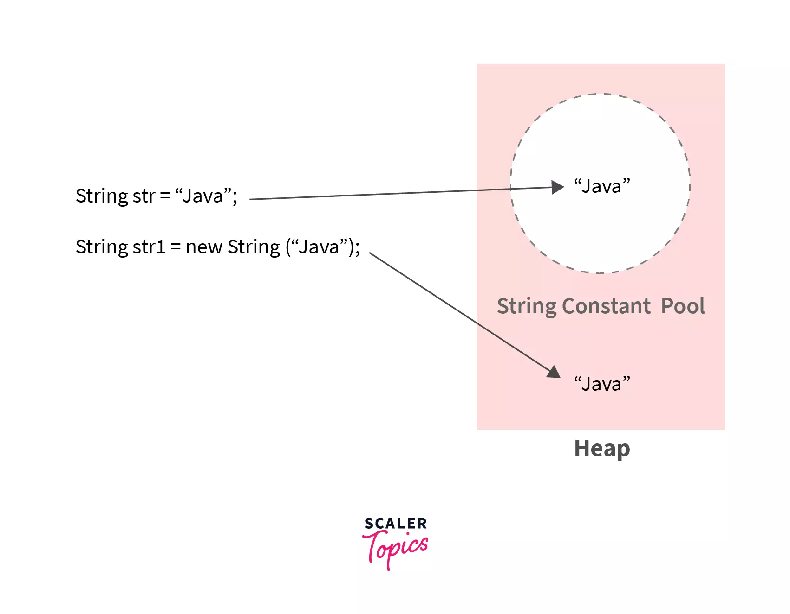
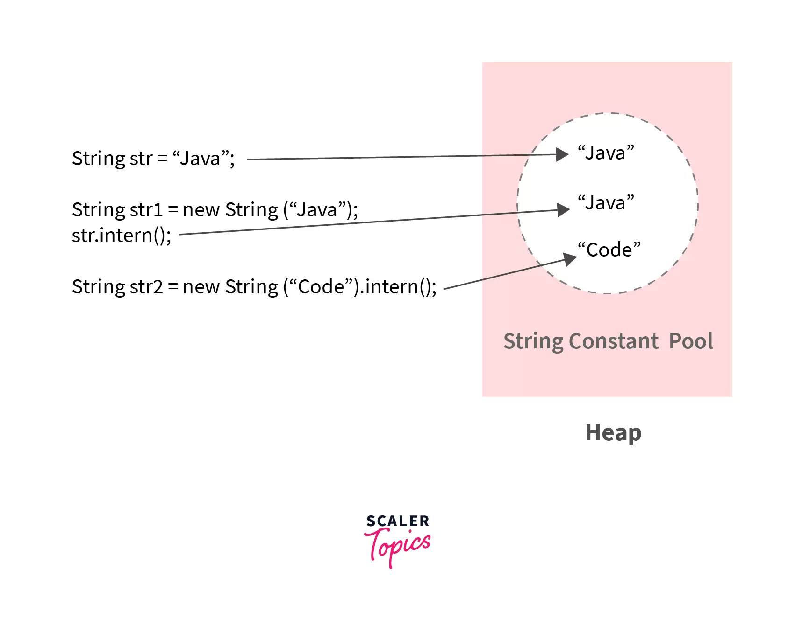
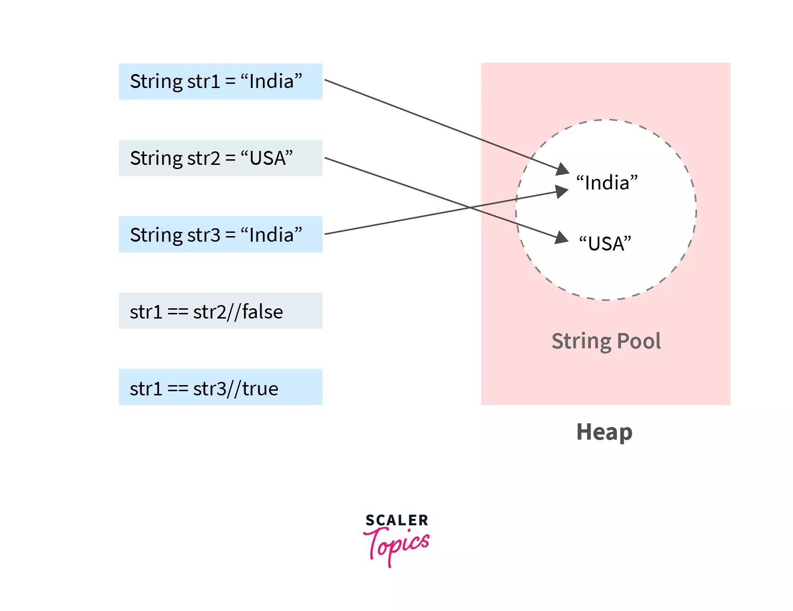
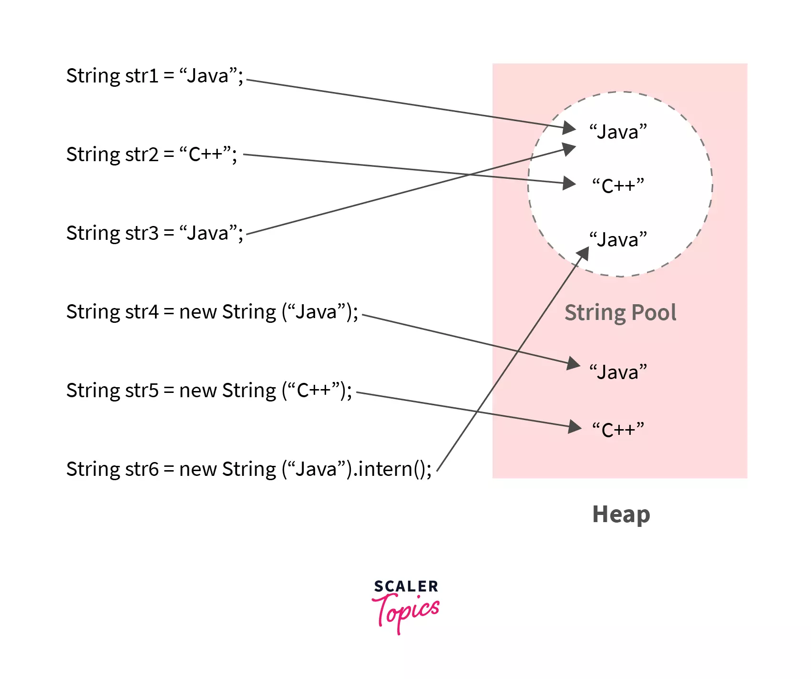

## String Pool
**String pool** is a storage space in the Java heap memory where string literals are stored. It is also known as **String Constant Pool or String Intern Pool**. It is privately maintained by the Java String class. By default, the String pool is empty. A pool of strings decreases the number of String objects created in the JVM, thereby reducing memory load and improving performance.

Strings are immutable in nature. Immutable means they have a constant value, and even if they are altered, instead of reflecting the alterations in the original string, a new object is created. This immutability is achieved through String Pool. Let us look at the concept of String Pool.

### What is String Pool in Java?
String Pool in Java is a special storage space in Java Heap memory where string literals are stored. It is also known by the names - String Constant Pool or String Intern Pool. Whenever a string literal is created, the JVM first checks the String Constant Pool before creating a new String object corresponding to it.

Let us first discuss the memory allocation methods used in Java - Stack Memory Allocation and Heap Memory Allocation.

    In stack memory, only the primitive data types like- int, char, byte, short, boolean, long, float and double are stored.
    Whereas, in the heap memory, non-primitive data types like strings are stored. A reference to this location is held by the stack memory.

Example:


Explanation:

    Since int and double are primitive data types, they are stored in the stack memory itself.
    However, idName stores a String that is non-primitive in nature. Hence, the String object is created in the heap memory, and its reference is stored by idName in the stack memory.

#### Memory Allocation in the String Pool
    The String Pool is empty by default, and it is maintained privately by the String class.
    When we create a string literal, the JVM first checks that literal in the String Constant Pool. If the literal is already present in the pool, its reference is stored in the variable.
    However, if the string literal is not found, the JVM creates a new string object in the String Constant Pool and returns its reference.
    Need of String Constant Pool:

    When we create a String object, it uses some amount of space in the heap memory.
    Let's say we are creating n number of String objects with the same value, and distinct memory is allocated to each of these string objects (though they all contain the same string).
    This is an inefficient usage of heap memory. In order to escalate the performance of our code and reduce memory usage, JVM optimizes the way in which strings are stored with the help of a string constant pool.
    
#### Ways to Create Strings

There are three popular ways of creating strings in Java:

1. String literal
2. Using new keyword
3. Using String.intern() method
4. Let us understand each of these three methods and their impact on the String Pool.

1. String literal

This is the simplest and most direct way to declare a string. It is done using double quotes.

Syntax:

```java
String <variable name> = “<value of string>”;```

Example:

```java
String str = "Java";
String str1 = "Java";
String str2 = "Study";
```

#### Changes in the String Pool:

    The String Pool is empty by default. Hence, when the compiler executes the first line, it creates a string literal "Java" in the String Constant Pool.
    When the compiler executes the second line, it first checks the String Constant Pool. Since the string literal "Java" is already present in the String Pool, its reference is stored in str1.
    As a result of the execution of the third statement, a new string literal "Study" is created in the String Constant Pool (since it is not already present). Its reference is stored in str2.

The figure shows the memory allocation of the above code.



    Whenever a string literal is created, the compiler checks the String Constant Pool first. If it encounters the same string, then instead of creating a new string, it returns the same instance of the existing string to the variable.

2. Using new keyword

    We can create new String objects using the new keyword. When we create new string literals using the new keyword, memory is allocated to those String objects in the Java heap memory outside the String Pool.

Syntax:

```java
String <variable name> = new String(“<value of the string>”);
```

Example:

```java
String str = "Java";
String str1 = new String("Java");
```

##### Changes in the Java heap memory:

    The first string gets stored in the String Constant Pool, but the second string object gets stored out of the string pool in the Java heap memory.

Here is the memory representation of the same.


    However, we can stop this kind of memory allocation to String objects using the String.intern() method in Java.

3. Using String.intern() method

    Creating strings using the new keyword allocates memory to the string object in the heap but outside the string constant pool. When we use the String.intern() method, JVM puts the string literal in the String Pool (if not already present), and its reference is stored in the variable. However, if the String Constant Pool already contains a string equal to the String object to be created, its reference is returned.
    
Syntax:

```java
<String name>.intern(); 
```

or

```java
String <variable name> = new String(<"string value">).intern();  
```

Example:

```java
String str = "Java";

String str1 = new String("Java").intern();

String str2 = new String("Code");
str2.intern();
```

Explanation:

* The first statement creates a new string literal in the String Constant Pool.
* The second variable str1 holds a reference of the already existing "Java" literal in the String Constant Pool.
* The third statement creates a new string literal in the String Pool as "Code" is not initially present.

The following figure illustrates the memory allocation for the same-



> Note:
>> For any two strings say str1 and str2, str1.intern() = = str2.intern() will be true if and only if the statement str1.equals(str2) will be true.

##### String Pool in Java Flow Diagram
Let us understand the working of a string pool with a basic diagram.



Explanation:

* The first statement creates a new string in the String Constant Pool, and str1 holds its reference.
* The Second statement executes in a similar fashion, and variable str2 holds the reference of "USA" from String Constant Pool.
* String str3 has the same value as str1, and both variables hold the reference of the same String object stored in the String Pool.
* == operator is used to compare the addresses of the objects and check whether they refer to the same instance.
* Here, since str1 and str2 are two different strings or objects, after comparing them with the == operator, it returns false.
* Whereas, when str1 and str3 are compared using the == operator, it returns true since it is referring to the same object.

Example of String Pool in Java

```java
public class StringPoolExample {

  public static void main(String args[]) {
    // These strings are created in the String Pool
    String str1 = "Java";
    String str2 = "C++";

    // JVM returns the reference of the pooled instance, i.e., str1
    // str3 will not be created in the string pool
    String str3 = "Java";

    // stored in Java heap memory outside the String Pool
    String str4 = new String("Java");
    String str5 = new String("C++");

    // str6 it will not get stored in the Java heap
    // it will hold reference of the already-existing String object with the value "Java"
    // in the String Constant Pool
    String str6 = new String("Java").intern();

    // false
    System.out.println(str1 == str4);

    // false
    //str2 occupies space in the string pool, and str7 occupies space in the Java heap
    System.out.println(str2 == str5);

    // true
    // address of both strings are the same
    System.out.println(str1 == str3);

    // true
    // address of both strings are the same
    System.out.println(str1 == str6);
  }
}
```

```java
Output:

false
false
true
true
```

Explanation:

Let us look at the figure which illustrates the memory allocation used in the program above.


#### Advantages of String Pool in Java
    
    Java String Pool allows caching of string. Caching here is the process of storing data in a cache. Cache improves performance and reduces memory usage.
    Provides reusability: It saves time to create a new string if there is already a string with the same value present in the pool. The old string is reused, and its reference is returned.

> Note:
>> String interning is a method of storing only one copy of each distinct string value, which must be immutable. In Java, String interning is achieved using the concept of String Pool.

#### Disadvantages of Using String Objects
    Strings have a constant value, and even if they are altered, instead of reflecting the changes in the original string, a new object is created.
    This causes a lot of objects to be created in the heap and wastes a lot of memory if the user keeps on updating the value of the string.

> Note:
>> In order to overcome the drawbacks of the String class, Java provides StringBuffer and StringBuilder classes. They are used to create mutable String objects.

#### Garbage Collection

   Before Java 7, the JVM placed the Java String Pool in the PermGen space, which has a fixed size — it can't be expanded at runtime and is not eligible for garbage collection.   
   The risk of interning Strings in the PermGen (instead of the Heap) is that we can get an OutOfMemory error from the JVM if we intern too many Strings.   
   From Java 7 onwards, the Java String Pool is stored in the Heap space, which is garbage collected by the JVM. The advantage of this approach is the reduced risk of OutOfMemory error because unreferenced Strings will be removed from the pool, thereby releasing memory.   

#### Performance and Optimizations

   In Java 6, the only optimization we can perform is increasing the PermGen space during the program invocation with the MaxPermSize JVM option:
   ```java
   -XX:MaxPermSize=1G
   ```

   In Java 7, we have more detailed options to examine and expand/reduce the pool size. Let's see the two options for viewing the pool size:

   ```java
   -XX:+PrintFlagsFinal
   ```
   ```java
   -XX:+PrintStringTableStatistics
   ```

   If we want to increase the pool size in terms of buckets, we can use the StringTableSize JVM option:

   ```java
   -XX:StringTableSize=4901
   ```
   Prior to Java 7u40, the default pool size was 1009 buckets but this value was subject to a few changes in more recent Java versions. To be precise, the default pool size from Java 7u40 until Java 11 was 60013 and now it increased to 65536.

   Note that increasing the pool size will consume more memory but has the advantage of reducing the time required to insert the Strings into the table.

##   # A Note About Java 9

   Until Java 8, Strings were internally represented as an array of characters – char[], encoded in UTF-16, so that every character uses two bytes of memory.   
   With Java 9 a new representation is provided, called Compact Strings. This new format will choose the appropriate encoding between char[] and byte[] depending on the stored content.   
   Since the new String representation will use the UTF-16 encoding only when necessary, the amount of heap memory will be significantly lower, which in turn causes less Garbage Collector overhead on the JVM.   
#### FAQs

1. What is meant by String Pool in Java?
String Pool in Java is a storage space in Java Heap memory where unique string literals are stored.

2. Where is the String Pool stored?
String Pool is stored in the Heap Memory.

3. Why do we need String Pool in Java?
It is created to decrease the number of string objects created in the memory. Whenever a new string is created, JVM first checks the string pool. If it encounters the same string, then instead of creating a new string, it returns a reference existing string to the variable.

4. Does string pool make Java more memory efficient?
Yes, a string pool helps to save memory by preserving immutable strings in a pool so that the instances can be reused.

Conclusion

* A string is a set of characters that are always enclosed in double-quotes.
* Strings in Java are immutable in nature.
* This immutability is achieved through String Pool.
* String Pool in Java is a special storage space in Java heap memory. It is also known as      String Constant Pool or String Intern Pool.
* Whenever a new string is created, JVM first checks the string pool. If it encounters the same string, then instead of creating a new string, it returns the same instance of the found string to the variable.
* The String.intern() method puts the string in the String pool or refers to another String object from the string pool having the same value.
* String Interning is a method that stores only a copy of each distinct string literal. String Pool is an implementation of the concept of String Interning.
* Java String Pool allows caching of string and reusability.